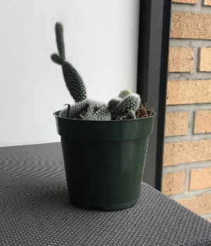

# Kubernetes enterprise control prototype

![ci results]

* TODO: add documentation.
* TODO: Set up continuous integration.

 <i>In K8us we trust.</i>

[ci results]: https://travis-ci.org/google/stolos.svg?branch=master
