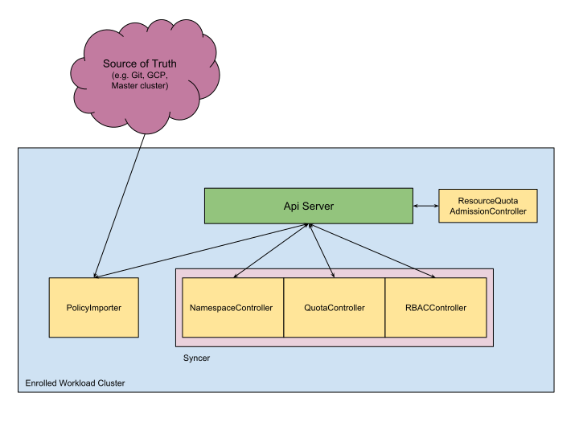

# System Overview

System diagram above shows all CSP Configuration Management components running
on multiple Kubernetes clusters. Each component is described below.

## git-policy-importer

A PolicyImporter is an abstraction for a controller that consumes policy
definitions from an external source of truth and builds a canonical
representation of the hierarchy using cluster-level CRD(s) defined by GKE Policy
Management. CSP Configuration Management can be extended to support different
sources of truth (e.g. Git, GCS, Active Directory) using different
implementations of this abstraction. Note that we treat this canonical
representation as internal implementation which should not be directly consumed
by users.

`git-policy-importer` is an implementation of PolicyImporter. The pod consists
of 2 containers:

*   `git-sync`: A side-car that pulls a Git repo into a volume mount. In the
    future, this can be replaced with other implementations reading from a
    different source of truth.
*   `policy-importer`: Reads the repo from the volume mount and reconciles
    resources via API server.

## CustomResourceDefinitions

CSP Configuration Management defines three custom resources:

*   `NamespaceConfig`: A resource that stores namespaces-level resources such as
    Roles and ResourceQuota.
*   `ClusterConfig`: A resource that stores cluster-level resources such as
    ClusterRoles and PodSecurityPolicies. There is only one ClusterConfig per
    cluster.
*   `Sync`: A resource that stores the resource types that CSP Configuration
    Management will sync from the source of truth.

## syncer

A controller (currently packaged as a single binary) that consumes the canonical
representation of the hierarchy produced by policy-importer and performs CRUD on
namespaces and [sync-enabled](system_config.md#Sync) resources.

## resourcequota-admission-controller

A ValidatingAdmissionWebhook that enforces hierarchical quota policies which
provides hierarchical quota on top of the existing ResourceQuota admission
controller. This is an optional component if the user chooses not to use
[hierarchical Resource Quota feature](rq.md).

## monitor

A controller that watches the ClusterConfig and all NamespaceConfigs as they get
updated by the controllers above. It aggregates status such as how many policies
are synced or stale and the latency between import and sync. All metrics are
exported as Prometheus metrics and documented on the
[Monitoring page](monitoring_and_debugging.md#gke-policy-management-metrics).

## nomos-operator

A [standard operator](https://coreos.com/operators/) which is used to install
Nomos components on a cluster and update them as new versions become available.

[< Back](../../README.md)
