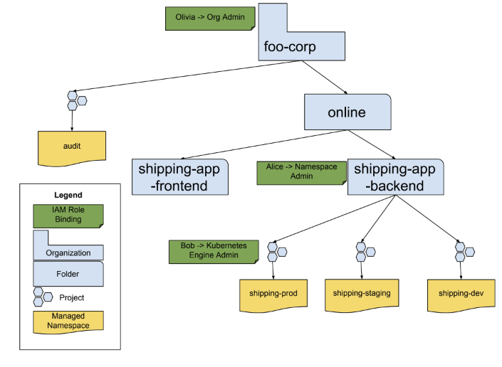

# GCP Overview

**NOTE: This is an Alpha release of Kubernetes Policy API and available to
whitelisted customers.**

GKE Policy Management supports using Google Cloud Platform to centrally manage
Namespaces and policies across Kubernetes clusters.

Existing [Resource Manager][1] API enables creating a hierarchy using
Organizations, Folders, and Projects. The new Kubernetes Policy API enables
creating a single *Managed Namespace* in a Project, such that there is a 1-to-1
mapping between a Project and a Managed Namespace. The user can then set
policies such as [IAM authorization][2] on each node in the hierarchy.

GKE Policy Management automatically creates and manages corresponding Kubernetes
Namespaces in all enrolled clusters and creates Kubernetes policy resources such
as RBAC based on hierarchical evaluation of policies defined in GCP.

## Managed Namespace Operations

The following is an example of foo-corp hierarchy using GCP resources:


This hierarchy of resources in GCP can be synced to any number of managed or
on-prem clusters using Kubernetes Policy Management.

### Before you begin

#### Set up GCP resources hierarchy

Organization, Folders, and Projects resources represent the hierarchy in an
organization. Refer to [Quickstarts][6] or more detailed [How-to Guides][7] to
create these resources and configure their IAM policies.

#### Activate API for each project

All the operations below require that the Kubernetes Policy API is activated.
You can do so by running the following command in each Project containing a
Managed Namespace:

```console
$ gcloud services enable kubernetespolicy.googleapis.com
```

#### Update gcloud components

Kubernetes Policy Management APIs are in alpha and you must install gcloud alpha
components to use them. You can do so by running these commands:

```console
$ gcloud components install alpha
$ gcloud components update
```

#### Whitelist your organization

Your organization must also be whitelisted to use the API by filling out the
[signup form][8] and getting approved. Customers who have not been whitelisted
will receive a `permission denied` error during creation.

### Creation

Managed Namespaces exist within a Project belonging to an organization. Start by
[creating][4] or using an existing Project. You can create the namespace in the
project by running:

```console
$ gcloud alpha container policy namespaces create [Kubernetes Name]
--project [Project ID]
```

For example, to create the Namespace `shipping-dev` from the diagram above run
the following commands:

```console
$ gcloud projects create foo-corp-shipping-dev --folder shipping-app-backend
$ gcloud services enable kubernetespolicy.googleapis.com --project
foo-corp-shipping-dev
$ gcloud organizations add-iam-policy-binding 515925372711
--member=user:me@foo-corp.com --role=roles/kubernetespolicy.namespaceCreator
$ gcloud alpha container policy namespaces create shipping-dev --project
foo-corp-shipping-dev
```

The Kubernetes name is the friendly name of your Kubernetes Namespace in each
enrolled cluster. It must meet the `DNS_LABEL` requirements specified in [5]. In
order to create the Managed Namespace, you need to have the permission
`kubernetespolicy.namespaces.create` at the Organization level, because by
creating the Managed Namespace, you will be affecting all clusters enrolled in
this Organization. The `kubernetespolicy.namespaces.create` permission is
included in the `Kubernetes Policy Namespace Creator`
(`roles/kubernetespolicy.namespaceCreator`), `Kubernetes Policy Namespace
Administrator` (`roles/kubernetespolicy.namespaceAdmin`), `Owner` and `Editor`
roles.

You are restricted to one Managed Namespace per Project to ensure you can grant
granular permissions at the project level for each Managed Namespace.

### Deletion

Deleting a Managed Namespace is a destructive operation. This operation will
delete the corresponding Kubernetes Namespace from every enrolled cluster,
including all the workloads running in them. This operation cannot be undone.

Managed Namespaces can be deleted by running the command:

```console
$ gcloud alpha container policy namespaces delete shipping-dev
--project foo-project-shipping-dev
```

The Managed Namespace name can be obtained from the result of the create call or
by calling `namespaces list` on the Project. You will need the
`kubernetespolicy.namespaces.delete` permission on the Project containing the
Managed Namespace, which is included in the `Kubernetes Policy Namespace Admin`,
`Editor` and `Owner` roles.

### Renaming

Renaming is not supported. To rename a Managed Namespace, you must delete and
recreate it with the new name.

### Moving

To move a Managed Namespace, you must move the Project containing it. If instead
you want to move the Managed Namespace to another Project, you must delete and
recreate it in the new Project.

## Policy Types

Kubernetes Policy Management only supports access control policies in this
release. Policies set in IAM are converted to RBAC policies in Kubernetes. More
policy types will be added in future releases.

### IAM Policies

Kubernetes Policy Management supports grants of IAM roles referring to any
Kubernetes permissions. Any IAM Role grant of a Kubernetes related role at the
Project, Folder or Organization level above a Managed Namespace will be
materialized as RBAC Roles and RoleBindings in that Kubernetes Namespace in
every enrolled cluster.

Kubernetes Policy Management creates RoleBindings at the namespace level and
ClusterRoles at the cluster level. No Roles or ClusterRolebindings are created.

#### RoleBindings

RoleBindings are created in each Kubernetes Namespace for every supported role
grant in IAM. All the role grants from the Organization, Folder(s) and Project
containing the Managed Namespace are inherited down to the Managed Namespace. In
the `foo-corp` example above, the role bindings of Olivia, Alice and Bob will
all be materialized in the `shipping-dev` Kubernetes Namespace in each enrolled
cluster.

#### ClusterRoles

The following curated IAM roles are created as ClusterRoles in every enrolled
cluster:

*   Kubernetes Engine Admin
*   Kubernetes Engine Developer
*   Kubernetes Engine Viewer
*   Owner
*   Editor
*   Viewer

Kubernetes Engine roles are described in more detail [here][3].

#### Current Limitations

In the alpha release, the following are not supported:

*   Custom roles
*   IAM binding conditions

## Next Steps

Consult the [installation guide](installation.md) for instructions on how to
install GKE Policy Management.

[1]: https://cloud.google.com/resource-manager
[2]: https://cloud.google.com/iam
[3]: https://cloud.google.com/kubernetes-engine/docs/how-to/iam#predefined
[4]: https://cloud.google.com/resource-manager/docs/creating-managing-projects
[5]: https://github.com/kubernetes/community/blob/master/contributors/design-proposals/architecture/identifiers.md
[6]: https://cloud.google.com/resource-manager/docs/quickstart-organizations
[7]: https://cloud.google.com/resource-manager/docs/how-to
[8]: http://goog.page.link/kpm-alpha
