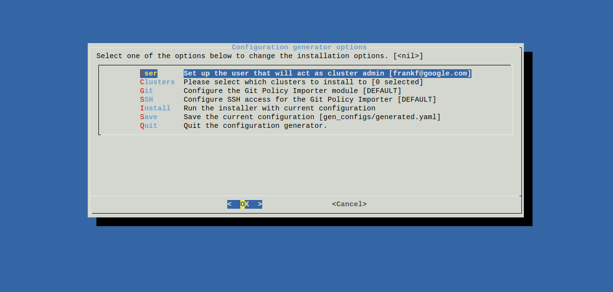

# Installing Nomos

## Important Note

**Do not install Nomos on a cluster with existing namespaces or workloads**

During the install process, Nomos deletes all namespaces that have been created
on the cluster. We are presently working on a non destructive installation
process, and this document will be updated accordingly when the mechanisms are
avialable.

## Requirements

Before installing Nomos, there are a few tasks that must be performed once to
ensure that your work environment is complete and able to support the
installation.

This setup takes about 30 minutes.

### Installation environments

The installation environments are sessions on a computer that you will run the
installation from. Any environments not mentioned here explicitly are untested,
so we can not make guarantees about them.

#### Linux

Currently the only tested environment for installation is Ubuntu 14.04 on amd64.

Prerequisites:

*   Installed `curl`: to download the installation script.
*   Installed `docker`: to run the installation script.
*   Installed `bash`: to run the installation script.

#### Google Cloud Shell

*Since: v0.4.0*

You can choose to install Nomos from within [Google Cloud
shell](https://www.google.com/shell/docs).

Prerequisites:

*   Verify that you can use `kubectl` within the Google Cloud shell to access
    the clusters that you plan to install Nomos on.

### Kubernetes

You need to have up and running Kubernetes clusters that you intend to install
Nomos on. You must be able to contact these clusters using `kubectl` from the
installation environment.

In order to run Nomos components, the cluster has to meet these requirements:

<table>
  <tr>
   <td><strong>Requirement</strong>
   </td>
   <td><strong>kube-apiserver flag</strong>
   </td>
  </tr>
  <tr>
   <td>Enable RBAC
   </td>
   <td>Add <em>RBAC</em> to list passed to <em>--authorization-mode</em>
   </td>
  </tr>
  <tr>
   <td>Enable ResourceQuota admission controller
   </td>
   <td>Add <em>ResourceQuota</em> to list passed to <em>--admission-control</em>
   </td>
  </tr>
  <tr>
   <td>Enable ValidatingAdmissionWebhook
   </td>
   <td>Add <em>ValidatingAdmissionWebhook</em> to list passed to <em>--admission-control</em>
   </td>
  </tr>
</table>

Minimum required Kubernetes Server Version: **1.9**

Note that GKE running K8S 1.9 satisfies all these requirements.

**Warning:** In the current release of Nomos, we require that all namespaces be
managed by Nomos. It is recommended to create a new cluster for use with Nomos.

The easiest way to get all of these is to follow the [GKE quick start
guide](https://cloud.google.com/kubernetes-engine/docs/quickstart) and make sure
to select version 1.9+ when creating the cluster.

### GitHub Repo

You will need to create SSH credentials to access the GitHub sample git
repository, and ensure that those credentials are usable for GitHub access. You
can choose to use any other Git provider instead and set up credentials
accordingly, in which case you can skip this section.

**IMPORTANT NOTE:** In production, it is recommended to use [deploy
keys](https://developer.github.com/v3/guides/managing-deploy-keys/#deploy-keys)
to grant access to a single GitHub repo instead of your personal account.

In a terminal session of your Linux machine issue the following command:

```console
$ ssh-keygen -t rsa -b 4096 -C "your_email@example.com" -N '' -f $HOME/.ssh/id_rsa.nomos
```

This command will create a pair of keys, `$HOME/.ssh.id_rsa.nomos`, and
`$HOME/.ssh.id_rsa.nomos.pub` that will be used to set up git repo access in
Nomos.

Note that the resulting private key must _not_ be password protected. This key
should not be used for purposes other than this example exercise.

[Upload](https://help.github.com/articles/adding-a-new-ssh-key-to-your-github-account/)
the file `$HOME/.ssh/id_rsa.nomos.pub`, which was generated in the previous
step, to your account on Github. This file will be used by the Nomos
installation to access the sample git repository. The file
`$HOME/.ssh/id_rsa.nomos` should be guarded carefully as any other private key
file.

Now, [test](https://help.github.com/articles/testing-your-ssh-connection/) your
SSH connection to github using the key you just generated.

```console
$ ssh -o IdentityAgent=/dev/null -F /dev/null -i $HOME/.ssh/id_rsa.nomos -T git@github.com
Hi <your_username>! You've successfully authenticated, but GitHub does not provide shell access.
```

An example policy hierarchy is available in [this Github
repository](https://github.com/frankfarzan/foo-corp-example). [Fork this repo on
Github](https://help.github.com/articles/fork-a-repo/) or to your preferred Git
hosting provider if you want to make changes.

You can now clone the sample repository locally as follows:

```console
$ ssh-add $HOME/.ssh/id_rsa.nomos
$ git clone git@github.com:frankfarzan/foo-corp-example.git foo
```

or your own copy as:

```console
$ git clone git@github.com:your_github_username/foo-corp-example.git
```

## Installation

Download the Nomos installer script to a directory on your machine.

```console
$ cd
$ mkdir -p tmp/nomos
$ cd tmp/nomos
$ curl https://storage.googleapis.com/nomos-release/run-installer.sh -o run-installer.sh
$ chmod +x run-installer.sh
```

The installer can run in two modes: batch (the default) and interactive
(menu-driven).

### Batch installation

Batch installation is based on reading a prepared configuration file. A sample
configuration is provided below. Most fields have been preset to point at the
sample configuration repository, but some you must supply, as noted below.

Note:

*   You must edit the contexts field to point at the list of clusters you want
    to install on. Use kubectl config get-contexts to see what contexts are
    available to you.
*   You must edit the user field to be set to your username that is valid for
    authenticating to the clusters. This username must be valid on all clusters
    included in the contexts field.
*   Please do NOT replace $HOME with the name of your actual home directory,
    leave it as a placeholder.
*   Update GIT_SYNC_REPO to point to your repo if you're not using the sample
    repo provided

```yaml
contexts:
  - kubeconfig_context_of_your_cluster
git:
  GIT_SYNC_BRANCH: master
  GIT_SYNC_REPO: git@github.com:frankfarzan/foo-corp-example.git
  GIT_SYNC_SSH: true
  KNOWN_HOSTS_FILENAME: $HOME/.ssh/known_hosts
  PRIVATE_KEY_FILENAME: $HOME/.ssh/id_rsa.nomos
  GIT_SYNC_WAIT: 60
  POLICY_DIR: foo-corp
user: youruser@foo-corp.com
```

Once you have finished with editing the file, you can run the batch installer as
follows:

```console
$ ./run-installer.sh --config=/path/to/your/config.yaml
```

Installer creates ConfigMaps and Secrets used by Nomos components. Refer to
[Reference](#config-reference) for details.

### Interactive installation

Interactive installation is menu driven. It allows you to edit the configuration
through a user-friendly menu as shown in the figure below:



You can start from a sample configuration:

```console
$ ./run-installer.sh --interactive
```

or you can start from an existing configuration, similar to the one in the
[Batch Installation](#batch-installation) section.

```console
$ ./run-installer.sh --interactive --config=/path/to/your/config.yaml
```

"Save" will store the current settings that you can then reuse later in a batch
installation. "Install" will run the installer on the chosen clusters. By
default, the configuration is saved as `gen_configs/generated.yaml`, i.e. a
subdirectory of the current working directory.

### Config Reference

This section enumerates ConfigMaps and Secrets used by Nomos. When using
installer, these are automatically created in `nomos-system` namespace.

#### Configmaps

##### git-policy-importer

Used by gitpolicyimporter deployment:

Key                        | Description                                                                              | Container
-------------------------- | ---------------------------------------------------------------------------------------- | ---------
GIT_SYNC_REPO              | the git repository to clone                                                              | git-sync
GIT_SYNC_BRANCH            | the git branch to check out                                                              | git-sync
GIT_SYNC_REV               | the git revision (tag or hash) to checkout                                               | git-sync
GIT_SYNC_DEPTH             | use a shallow clone with a history truncated to the specified number of commits          | git-sync
GIT_SYNC_WAIT              | the number of seconds between syncs                                                      | git-sync
GIT_SYNC_MAX_SYNC_FAILURES | the number of consecutive failures allowed before aborting (the first pull must succeed) | git-sync
GIT_SYNC_USERNAME          | the username to use                                                                      | git-sync
GIT_SYNC_PASSWORD          | the password to use                                                                      | git-sync
GIT_SYNC_SSH               | use SSH for git operations                                                               | git-sync
GIT_KNOWN_HOSTS            | enable SSH known_hosts verification                                                      | git-sync
POLICY_DIR                 | Relative path of root policy directory in the repo                                       | policy-importer

#### Secrets

##### git-creds

Used by gitpolicyimporter deployment:

Key         | Description          | Container
----------- | -------------------- | ---------
ssh         | SSH private key      | git-sync
known_hosts | SSH known hosts file | git-sync

See [git-sync
docs](https://github.com/kubernetes/git-sync/blob/master/docs/ssh.md) for more
information

## Verify installation

To verify that Nomos components are correctly installed, issue the following
command and verify that all components listed have status displayed as
"Running."

Check running components:

```console
$ kubectl get pods -n=nomos-system
NAME                                                  READY     STATUS    RESTARTS   AGE
git-policy-importer-66bf6b9db4-pbsxn                  2/2       Running   0          24m
policynodes-admission-controller-6746f96cbb-2h2sf     1/1       Running   0          24m
resourcequota-admission-controller-64988d97f4-nxmsc   1/1       Running   0          24m
syncer-58545bc77d-l485n                               1/1       Running   0          24m
```

Check present namespaces:

```console
$ kubectl get ns
NAME               STATUS    AGE
audit              Active    2m
default            Active    2m
kube-public        Active    2m
kube-system        Active    2m
shipping-dev       Active    2m
shipping-prod      Active    2m
shipping-staging   Active    2m
nomos-system       Active    2m

```

## Uninstalling

To uninstall Nomos from a set of clusters, you need the `config.yaml` file used
for the original installation, and the `run-installer.sh` script.

Executing the following command will uninstall Nomos components.

```console
./run-installer.sh --config=/path/to/your/config.yaml --uninstall=deletedeletedelete

```

The affected components are:

*   The namespace `nomos-system` along any workloads running inside of it.
*   Any cluster level roles and role bindings installed by Nomos.
*   Any admission controller configurations installed by Nomos.

In addition, removing Nomos from the cluster may affect user workloads that
interact with the Kubernetes API server.

## Reinstalling

It is possible to reuse an existing installer configuration multiple times to
reinstall Nomos.  To run the reinstall use the batch installation mode with
your existing configuration:

```console
$ ./run-installer.sh --config=/path/to/your/config.yaml
```

The effect of the reinstallation is to run the equivalent of `kubectl apply` to
almost all the Kubernetes components in the Nomos installation package.  The
exception are certificates and required secrets, which are removed prior to the
bulk of reinstall process.  This has the effect of installing a fresh copy of
the certificates and secrets.  Namespaces and deployments may not be affected
if the reinstall would not change their state.

# Installing Nomosvet

`nomosvet` is tool that validates a root policyspace directory. See [User
Guide](user_guide.md#validation) for installation and usage.
