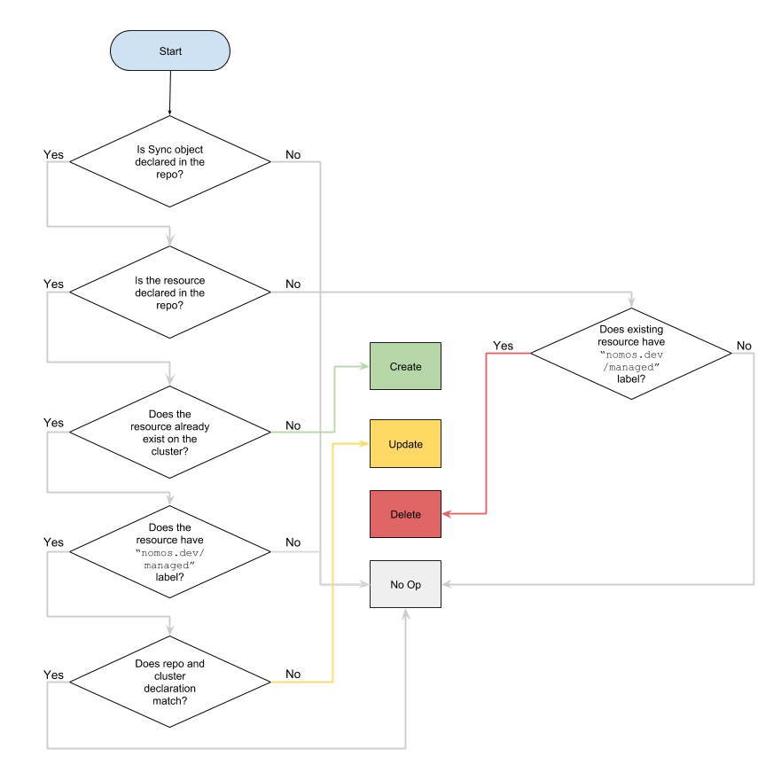

# Management Flow

## Introduction

GKE Policy Management checks for the `nomos.dev/managed=enabled` label to
determine if it should perform management operations on an resource. If the
resource on cluster differs from the desired state, the cluster state will be
updated to match the desired state. For resources that are no longer in Git,
they will be removed from the cluster if they have the label. If a user removes
the `nomos.dev/managed=enabled` label from an resource, nomos will no longer
manage the resource.

## Resource Control Flow

The following decision tree shows the expected operations taken by GKE Policy
Management System based on the desired state in the Git repo and the current
state of the cluster, including the management labels applied by the user.



Examples:

*   ClusterRole `pod-accountant` exists on the cluster, but does not exist in
    Git for
    [foo-corp](https://github.com/frankfarzan/foo-corp-example/tree/0.1.0). GKE
    Policy Management is installed for foo-corp and has a
    [Sync](https://github.com/frankfarzan/foo-corp-example/blob/0.1.0/foo-corp/system/rbac-sync.yaml)
    for ClusterRole. GKE Policy Management will not delete or alter
    `pod-accountant`.
*   GKE Policy Management is installed for foo-corp. Someone adds a new
    ClusterRole `quota-viewer` to Git in
    `foo-corp/cluster/quota-viewer-clusterrole.yaml`. GKE Policy Management will
    now create the `quota-viewer` ClusterRole matching the one in Git. Time
    passes. Someone deletes the `quota-viewer-clusterrole.yaml` from Git. GKE
    Policy Management will now remove `quota-viewer` from the cluster.
*   Role `job-creator` exists on the cluster in shipping-dev namespace with a
    `nomos.dev/managed` label applied and exists in Git for
    [foo-corp](https://github.com/frankfarzan/foo-corp-example). GKE Policy
    Management is installed for foo-corp and has a
    [Sync](https://github.com/frankfarzan/foo-corp-example/blob/0.1.0/foo-corp/system/rbac-sync.yaml)
    for Role. GKE Policy Management will now update `job-creator` to match the
    one declared in
    [job-creator-role.yaml](https://github.com/frankfarzan/foo-corp-example/blob/0.1.0/foo-corp/namespaces/online/shipping-app-backend/shipping-dev/job-creator-role.yaml).
*   foo-corp has a RoleBinding
    [pod-creators](https://github.com/frankfarzan/foo-corp-example/blob/0.1.0/foo-corp/namespaces/online/shipping-app-backend/pod-creator-rolebinding.yaml)
    in Git and a
    [Sync](https://github.com/frankfarzan/foo-corp-example/blob/0.1.0/foo-corp/system/rbac-sync.yaml)
    for Rolebinding. GKE Policy Management will ensure that all `pod-creator`
    rolebindings in descendants of the `shipping-app-backend` Abstract Namespace
    (`shipping-prod`, `shipping-staging`, `shipping-dev`) exactly match the
    declared `pod-creator` RoleBinding. Time passes and someone modifies the
    [shipping-prod](https://github.com/frankfarzan/foo-corp-example/tree/0.1.0/foo-corp/namespaces/online/shipping-app-backend/shipping-prod)
    `pod-creator` RoleBinding. GKE Policy Management will notice the change and
    update `pod-creator` to match the declaration in Git. Time passes and
    someone removes `pod-creator` from Git. GKE Policy Management will now
    remove the `pod-creator` resource from the descendant namespaces.
*   Foo-corp has a
    [Sync](https://github.com/frankfarzan/foo-corp-example/blob/0.1.0/foo-corp/system/rbac-sync.yaml)
    for Role. Someone creates a `secret-admin` Role in `shipping-prod`. GKE
    Policy Management will notice that the Role is not declared in
    `shipping-prod` or any of its ancestors, but will not delete it because it
    does not have a `nomos.dev/managed` label applied on it. Later on, the
    `nomos.dev/managed` label is added ot it. GKE Policy Management will now
    delete the `secret-admin` Role from the namespace.
*   Namespace
    [audit](https://github.com/frankfarzan/foo-corp-example/blob/0.1.0/foo-corp/namespaces/audit/namespace.yaml)
    is not on the cluster and is added to Git. GKE Policy Management will create
    the `audit` Namespace with a `nomos.dev/managed` label even though there is
    no Sync declared for namespaces because Namespace sync is always enabled.

## Namespaced Resources Interaction with Management Labeling on Namespaces

The management label `nomos.dev/managed=enabled` applies to Namespaces, however,
there is subtle interaction with the resources contained within the namespace.

### Managed Namespaces

If a namespace object has a `nomos.dev/managed=enabled` label, then deleting the
namespace from Git will result in GKE Policy Management deleting the namespace
on the cluster and consequently all objects in the namespace will be deleted
regardless of whether those objects have a management label. Consider this
behavior analogous to granting `rwx` UNIX directory permissions where a user
can't read or write the content of files in the directory, but can still delete
them.

Example:

Namespace
[shipping-dev](https://github.com/frankfarzan/foo-corp-example/blob/0.1.0/foo-corp/namespaces/online/shipping-app-backend/shipping-dev/namespace.yaml)
exists on the cluster with no management label and RoleBinding
[job-creators](https://github.com/frankfarzan/foo-corp-example/blob/0.1.0/foo-corp/namespaces/online/shipping-app-backend/shipping-dev/job-creator-rolebinding.yaml)
exists in the `shipping-dev` namespace with the `nomos.dev/managed` label and
foo-corp has a
[Sync](https://github.com/frankfarzan/foo-corp-example/blob/0.1.0/foo-corp/system/rbac-sync.yaml)
for RoleBinding. `job-creators` will not be managed at this time. Someone adds
`shipping-dev` and `job-creators` to Git. The `job-creators` resource will be
updated to match the declaration in Git because it has a `nomos.dev/managed`
label, but the `shipping-dev` Namespace will remain untouched because it does
not have a `nomos.dev/managed` label.

### Unmanaged Namespaces

If a namespace doesn't have the `nomos.dev/managed=enabled` label, objects
inside the namespace will still be managed if they have a
`nomos.dev/managed=enabled` label.

Example:

Namespace
[shipping-dev](https://github.com/frankfarzan/foo-corp-example/blob/0.1.0/foo-corp/namespaces/online/shipping-app-backend/shipping-dev/namespace.yaml)
exists on the cluster with no management label and RoleBinding
[job-creators](https://github.com/frankfarzan/foo-corp-example/blob/0.1.0/foo-corp/namespaces/online/shipping-app-backend/shipping-dev/job-creator-rolebinding.yaml)
exists in the `shipping-dev` namespace with the `nomos.dev/managed` label and
foo-corp has a
[Sync](https://github.com/frankfarzan/foo-corp-example/blob/0.1.0/foo-corp/system/rbac-sync.yaml)
for RoleBinding. `job-creators` will not be managed at this time. Someone adds
`shipping-dev` and `job-creators` to Git. The `job-creators` resource will be
updated to match the declaration in Git because it has a `nomos.dev/managed`
label, but the `shipping-dev` Namespace will remain untouched because it does
not have a `nomos.dev/managed` label.

## Sync and Resource Precedence

GKE Policy Management considers Sync changes to have higher precedence. This is
because it leads to less destructive actions on the cluster.

For example, removing a Sync and all the resources it manages will disable
management for those resources. But, it will leave all existing managed
resources on the cluster.

```console
$ git rm system/resourcequota-sync.yaml namespaces/eng/quota.yaml namespaces/backend/quota.yaml namespaces/rnd/quota.yaml
$ git commit -am "remove quota"
$ git push origin master
$ kubectl get resourcequota --all-namespaces -l nomos.dev/managed
NAMESPACE   NAME                   AGE
analytics   nomos-resource-quota   26s
backend     nomos-resource-quota   27s
frontend    nomos-resource-quota   29s
new-prj     nomos-resource-quota   26s
newer-prj   nomos-resource-quota   25s
```

If instead we remove all the resources first and then remove the Sync in a
separate commit, none of the managed resources will remain on the cluster.

First we remove all the ResourceQuotas in the repo.

```console
$ git rm namespaces/eng/quota.yaml namespaces/backend/quota.yaml namespaces/rnd/quota.yaml
$ git commit -am "remove quota resources"
$ git push origin master
```

Wait for GKE Policy Management to remove all the ResourceQuotas.

```console
$ while (( $(kubectl get resourcequota --all-namespaces -l nomos.dev/managed 2> /dev/null | wc -l) != 0 )); do
  sleep 1
done
```

Disable policy management for ResourceQuotas.

```console
$ git rm system/resourcequota-sync.yaml
$ git commit -am "remove quota management"
$ git push origin master
```

We end up with no ResourceQuotas on the cluster and no policy management for
ResourceQuotas.

```console
$ kubectl get resourcequota --all-namespaces -l nomos.dev/managed
No resources found.
```

## Namespaces

Nomos handles Namespaces as a first-class notion with regard to lifecycle
management. There are three categories of namespaces: Managed, Reserved, and
Legacy Namespaces.

1.  **Reserved Namespaces** are namespaces that are either pre-installed on the
    kubernetes cluster (`kube-*`, `nomos-system`, `default`) or
    [designated as reserved](system_config.md#reserved-namespaces) by the user.
    Reserved namespaces and the resources within them **will not be managed**
    even if the namespace and/or resource has a nomos.dev/managed=enabled label.
1.  **Managed Namespaces** are namespaces on the cluster that GKE Policy
    Management keeps in sync with the repo. The Namespace **MUST** have the
    label nomos.dev/managed=enabled on cluster and exist in the Git source of
    truth. They are created when added to Git, and deleted when removed from
    Git.
1.  **Legacy Namespaces** are namespaces on the cluster without the
    nomos.dev/managed=enabled label. They will cause alerts for being in a
    non-ideal state, however, GKE Policy Management will neither update nor
    delete them. Resources inside of a Legacy Namespace will be managed
    according to their labeling.

[< Back](../../README.md)
