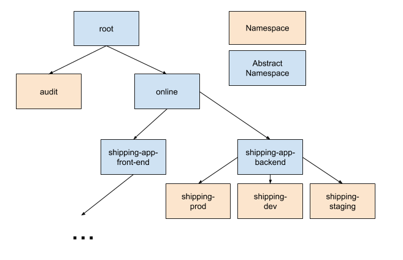

# Overview

GKE Policy Management supports using Git to centrally manage Namespaces and
Kubernetes resources across Kubernetes clusters. This *Policy as Code* approach
ensures policy configurations are:

*   __Immutable:__ A Git commit is an exact declaration of the desired state of
    policies.
*   __Auditable:__ Changes are reviewed and approved by administrators.
*   __Revertable:__ Misconfiguration is one of the most common reasons for
    service outages. It should be fast and easy to revert to a known good state.

In addition, the rich CI/CD ecosystem built around Git enables building
sophisticated pipelines for vetting and deploying at scale.

## Table of Contents

1.  [Filesystem Standard](#filesystem-standard)
    1.  [namespaces/](#namespaces)
    1.  [cluster/](#cluster)
    1.  [system/](#system)
1.  [Filesystem Operations](#filesystem-operations)
    1.  [Creation](#creation)
    1.  [Deletion](#deletion)
    1.  [Rename](#rename)
    1.  [Move](#move)
1.  [Nomos CLI](#nomos-cli)
    1.  [init](#init)
    1.  [vet](#vet)
    1.  [view](#view)

## Filesystem Standard

GKE Policy Management Filesystem Standard defines the directory structure and
file contents. This is analogous to the Linux Filesystem Hierarchy Standard, and
is a natural way to operate on hierarchical resources without requiring a
complicated domain specific language.

For example, we can have such a directory structure
([Available on this GitHub repo](https://github.com/frankfarzan/foo-corp-example/tree/0.1.0)):

```console
foo-corp
├── cluster
│   ├── namespace-reader-clusterrolebinding.yaml
│   ├── namespace-reader-clusterrole.yaml
│   ├── pod-creator-clusterrole.yaml
│   └── pod-security-policy.yaml
├── namespaces
│   ├── audit
│   │   └── namespace.yaml
│   ├── online
│   │   └── shipping-app-backend
│   │       ├── shipping-dev
│   │       │   ├── job-creator-rolebinding.yaml
│   │       │   ├── job-creator-role.yaml
│   │       │   ├── namespace.yaml
│   │       │   └── quota.yaml
│   │       ├── shipping-prod
│   │       │   └── namespace.yaml
│   │       ├── shipping-staging
│   │       │   └── namespace.yaml
│   │       ├── pod-creator-rolebinding.yaml
│   │       └── quota.yaml
│   ├── sre-rolebinding.yaml
│   ├── sre-supported-selector.yaml
│   └── viewers-rolebinding.yaml
└── system
    ├── nomos.yaml
    ├── podsecuritypolicy-sync.yaml
    ├── rbac-sync.yaml
    └── resourcequota-sync.yaml
```

We define the semantics of each directory below:

### namespaces/

`namespaces` directory is the root of the namespace hierarchy and contains
namespace-scoped resources (e.g. RBAC RoleBindings).

Kubernetes does not natively provide a hierarchy of namespaces (namespaces are
flat). GKE Policy Management implements a hierarchy of namespaces to enable
management of a large number of resources across many teams.

There are two types of sub-directories in `namespaces`:

*   __Namespace directory:__ A directory containing a Namespace resource. A
    Namespace directory is a one-to-one mapping to a Kubernetes [Namespace][1].
*   __Abstract Namespace directory:__ Any other directory. Conceptually, an
    Abstract Namespace directory represents an intermediate node in the
    namespace hierarchy.

As an example of how `shipping-prod` Namespace is declared:

```console
$ cd foo-corp
$ cat namespaces/online/shipping-app-backend/shipping-prod/namespace.yaml
```

```yaml
apiVersion: v1
kind: Namespace
metadata:
  name: shipping-prod
  labels:
    env: prod
```

In foo-corp, our hierarchy looks like this:



By modeling the hierarchy like this, we enable the Shipping App Backend team to
manage three different namespaces while only have to maintain one authorization
policy for team members. Each of their namespaces is isolated by environment,
allowing identically-named objects in the three environments' instantiations of
the backend stack, as well as providing tighter security, e.g. allowing one
namespace to have additional authorized users but not the others, and allocating
private quota to each namespace.

The following constraints apply to `namespaces` directory and are enforced
during [validation](#vet):

1.  A Namespace directory MUST be a leaf directory.
1.  A Namespace directory's name MUST match `metadata.name` field of the
    contained Namespace resource.
1.  A Namespace directory MAY contain any number of uniquely named
    namespace-scoped resources.
1.  An Abstract Namespace directory MAY contain any number of hierarchical
    resources.
1.  Resources MUST NOT specify `metadata.namespace` field as it is inferred
    automatically.
1.  All directory names MUST be valid Kubernetes namespace names (i.e.
    [DNS Label](https://github.com/kubernetes/community/blob/master/contributors/design-proposals/architecture/identifiers.md)).
    In addition a name MUST NOT be `default`, `nomos-system`, or have `kube-`
    prefix. This topic is discussed in depth in
    [Management Flow](management_flow.md).
1.  All directory names MUST be unique in the hierarchy.

### cluster/

`cluster` directory contains cluster-scoped resources (e.g. RBAC
ClusterRolebindings).

The following constraints apply to `cluster` directory and are enforced during
[validation](#vet):

1.  The cluster directory MAY contain any number of uniquely named
    cluster-scoped resources.
1.  The cluster directory MUST NOT contain namespace-scoped resources.

### system/

`system` directory contains resources for configuring the GKE Policy Management
system.

The `system` directory MUST only contain the `nomos.dev` objects, and an
optional ConfigMap (core v1) containing
[reserved namespaces](system_config.md#reserved-namespaces). See
[GKE Policy Management System Configuration](system_config.md).

## Filesystem Operations

### Creation

When a valid namespace hierarchy is committed to Git and synced, GKE Policy
Management controllers automatically create namespaces and corresponding
Kubernetes resources to enforce hierarchical resource syncing. In the foo-corp
example, GKE Policy Management automatically creates `audit`, `shipping-dev`,
`shipping-staging` and `shipping-prod` namespaces.

Note that when using Git as source of truth, it is up to the repo owners to set
proper access control mechanism (e.g. using OWNERS or CODEOWNER files) to ensure
right people can approve/review/commit Kubernetes resource changes. It is
recommended to use a hierarchical access control mechanism such as OWNERS file
in order to delegate Kubernetes resource changes instead of requiring a central
authority to approve all changes.

### Deletion

Deleting a Namespace directory is a very destructive operation. All resources
including identities, policies and workload resources will be deleted on every
cluster where this namespace is present. Similarly deleting an Abstract
Namespace directory, deletes all descendant names and associated resources.

### Rename

Renaming a Namespace directory (which requires renaming Namespace name as well)
is destructive since it **deletes that namespace and creates a new namespace in
Kubernetes**.

Renaming an Abstract Namespace directory has no externally visible effect.

### Move

Moving a Namespace or an Abstract Namespace directory can lead to operations on
Kubernetes resource in namespaces, but does not delete a namespace or workload
resources.

[1]: https://kubernetes.io/docs/concepts/overview/working-with-objects/namespaces/

## Nomos CLI

The `nomos` CLI provides tools for creating and managing a GKE Policy Management
directory.

To install nomos:

```console
$ curl -LO https://storage.googleapis.com/nomos-release/stable/linux_amd64/nomos
$ chmod u+x nomos
```

You can replace `linux_amd64` in the URL with the following supported platforms:

*   `darwin_amd64`
*   `windows_amd64`

For `nomos` to work properly, you need to have already
[installed Nomos system](installation.md) on the cluster pointed to by current
context configured through `kubectl`:

```console
$ kubectl config current-context
```

The following commands assume that you placed `nomos` in a directory mentioned
in your `$PATH` environment variable.

To see usage:

```console
$ nomos --help
```

### init

Use `nomos init` to begin a new GKE Policy Management directory. Given an empty
directory, populates it with required files and a few commonly-needed objects to
get you started.

```console
$ mkdir newrepo
$ cd newrepo
$ git init
$ nomos init
```

See `nomos init --help` for more.

### vet

Before committing changes to Git and pushing changes to Kubernetes clusters, it
is critical to validate them first.

`nomos vet` is tool that validates a GKE Policy Management directory by:

1.  Enforcing
    [GKE Policy Management Filesystem Standard](overview.md#filesystem-standard).
2.  Validating resources using the Kubernetes API machinery discovery mechanism
    and OpenAPI spec (Similar to `kubectl apply --dry-run`).

You can manually run nomos:

```console
$ cd foo-corp
$ nomos vet
```

If any issues are found, `vet` returns a non-zero exit code and prints error
messages to `stderr`.

You can also automatically run nomos vet as a git
[pre-commit hook](https://git-scm.com/book/en/v2/Customizing-Git-Git-Hooks). In
the root of the repo, run:

```console
$ echo "nomos vet --path foo-corp" > .git/hooks/pre-commit; chmod +x .git/hooks/pre-commit
```

You can also integrate this into your CI/CD setup, e.g. when using GitHub
[required status check](https://help.github.com/articles/about-required-status-checks/).

### view

As discussed in [System Overview](system_overview.md), contents of the Git repo
are converted to ClusterPolicy and PolicyNode CRDs during the import process. To
print the generated CRD resources in JSON:

```console
$ cd foo-corp
$ nomos view
```

This can be handy to preview the diff of a change before it is committed.

[< Back](../../README.md)
