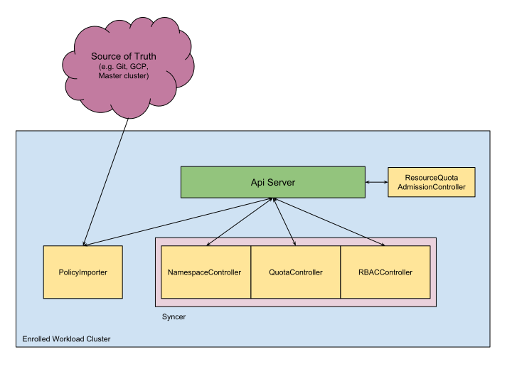

# User Guide

## Overview

In environments with many users spread across many teams, having multiple tenants within a cluster, allocated into namespaces, maximizes resource utilization while providing isolation. However, as the number of namespaces grows, it becomes increasingly hard for cluster operators to manage per-namespace policies like authorization (RBAC Roles/Rolebinding) and quota (ResourceQuota), etc. In addition, real world deployments often require multiple clusters in order to tolerate region failures, reduce network latencies for end users, or simply to scale beyond the current size limits of a Kubernetes cluster. Stolos makes it easier to manage large multi-tenant and multi-cluster deployments, by reducing the load on cluster operators and reducing the surface area to secure.

At a high level, Stolos serves two separate functions:


*   **Policy distribution**: Distribute policy definitions from a centralized source of truth to all workload clusters. The extensible policy distribution mechanism allows Stolos to support a wide range of technologies implementing the source of truth for policies (e.g. YAML files in Git, Google Cloud IAM & admin, Active Directory, etc.)
*   **Hierarchical policy enforcement**: Group together namespaces and associated policies into a hierarchy modelled after how departments and teams are organized. Stolos provides a set of controllers running on the workload clusters that consume hierarchical policies definitions and are responsible for enforcing them.

In this release, there are four main areas that Stolos helps manage:


1.  **Namespaces**:  With Stolos you have one set of namespaces that apply to all clusters.   Stolos also introduces hierarchical namespace support giving you the ability to group namespaces together for common policies and to facilitate delegation.  In Stolos, only leaf namespaces can contain non-policy resources, while the intermediate and root nodes provide policy attach points for policies such as RBAC, ResourceQuota, and more.
1.  **Hierarchical RBAC policies**:  Stolos provides central management of RBAC policies and enables inheritance of namespace-level RBAC resources. For example a Rolebinding from an ancestor is inherited by all descendent namespaces, removing duplication.
1.  **Hierarchical ResourceQuota policies**:  With Stolos one can manage quota centrally and set quota hierarchically.
1.  **Cluster-level policies:** In addition to namespace-level policies, Stolos allows you to centrally manage cluster-level policies such as ClusterRole/Rolebinding and PodSecurityPolicy.

This guide will take you through managing each of these resources.


### Stolos Concepts


#### Namespaces

In Kubernetes, namespaces are the isolation construct for implementing multi-tenancy and are the parents of all workload resources (pods, replica sets, service accounts, etc). Namespaces can be used to isolate workloads that have the same set of human owners as well as to isolate different workload environments.

Generally anytime you want to have a workload managed by a distinct person or set of people (e.g. on-call person only for prod workloads, whole development team for dev workloads), it makes sense to create a new namespace.  If you want to have a common person or set of people be able to perform the same set of operations within a set of namespaces, create a policyspace.

Stolos with its hierarchical control allows many namespaces to be managed by the same set of people so it's possible to create more granular namespaces for a team of people without incurring additional policy administration overhead.


#### Policyspaces

With Stolos, we give admins the ability to group namespaces together and to form groups of groups through a hierarchy.  We call a non-leaf node in this tree, whose leaves are namespaces, a  policyspace. We can think of policyspaces as Organization Units (or Policy Information Point in [XACML](https://en.wikipedia.org/wiki/XACML#Terminology) parlance).  They exist to delegate policy control to sub organization leaders. This approach has been long established by LDAP and Active Directory.

Policyspaces can be parents of policyspaces and namespaces. Policyspace and namespaces must both be globally unique.


#### Delegation

As the organization complexity grows, it is important for an admin to have the ability to delegate administration of a subset of the hierarchy to another admin. The mechanism for delegation is specific to the source of truth. For example, on Google Cloud Platform, an admin can grant setIamPolicy permission to someone who can then set policies independently. In Git, the admin can give commit permissions to a subtree to someone else.


#### Example

One can imagine a brick and mortar retailer having a hierarchy of policyspaces and namespaces that looks like this


In Foo corp, a small team (8-10 people) runs a few microservice workloads that together provide a bigger component.  Everyone on the team has the same set of roles (e.g. deployment, on-call, coding, etc).  We also assume that the small team will run a dev and staging setup for qualification and will want to ensure that these environments have different security postures. Also these workloads need to run in multiple regions.

This gives the ability for the Shipping App Backend team to manage three different namespaces but only have to maintain one authorization policy for team members.  Each of their namespaces is isolated by environment, allowing identically-named objects in the three envionments' instantiations of the backend stack, as well as providing tighter security, e.g. allowing one namespace to have additional authorized users but not the others, and allocating private quota to each namespace. 


### System Overview


 

The above diagram is a simplified view of Stolos components running on a workload cluster. Each component is described below.


#### PolicyImporter

PolicyImporter is an abstraction for a controller that consumes policy definitions from an external source of truth and builds a canonical representation of the hierarchy using cluster-level CRD(s) defined by Stolos. Stolos can be extended to support different sources of truth (e.g. Git, GCP, Active Directory) using different implementations of this abstraction. Note that we treat this canonical representation as internal implementation which should not be directly consumed by users.


#### Syncer

A set of controllers (currently packaged as a single binary) that consume the canonical representation of the hierarchy produced by PolicyImporter and perform CRUD on namespaces and native K8S policy resources such as Role/Rolebinding, ResourceQuota, etc.


#### ResourceQuotaAdmissionController

A ValidatingAdmissionWebhook that enforces hierarchical quota policies which providers hierarchical quota on top of existing ResourceQuota admission controller.


## Set Up

There's a one-time set up required to set up Stolos components described in this section. The user running these commands should have a cluster-admin rolebinding.


### Cluster Requirements

In order to run Stolos components, the cluster has to meet these requirements:


<table>
  <tr>
   <td><strong>Requirement</strong>
   </td>
   <td><strong>kube-apiserver flag</strong>
   </td>
  </tr>
  <tr>
   <td>Enable RBAC
   </td>
   <td>Add <em>RBAC</em> to list passed to <em>--authorization-mode</em>
   </td>
  </tr>
  <tr>
   <td>Enable ResourceQuota admission controller
   </td>
   <td>Add <em>ResourceQuota</em> to list passed to <em>--admission-control</em>
   </td>
  </tr>
  <tr>
   <td>Enable ValidatingAdmissionWebhook
   </td>
   <td>Add <em>ValidatingAdmissionWebhook</em> to list passed to <em>--admission-control</em>
   </td>
  </tr>
</table>


Minimum required Kubernetes Server Version: **1.9**

Note that GKE running K8S 1.9 satisfies all these requirements.

**Warning: **In the current release of Stolos, we require that all namespaces be managed by Stolos. It is recommended to create a new cluster for use with Stolos.


### Installing Stolos

The Stolos components need to be installed on each workload cluster and given the appropriate K8S Cluster RBAC authorizations to manage namespaces, quota resources, and other policy objects.

Download and extract a release archive:


```
$ wget \
https://github.com/GoogleCloudPlatform/stolos/releases/download/v0.0.1/stolos.tar.gz
```


Install Stolos components on each workload cluster:


```
$ kubectl config use-context ${CLUSTER_CONTEXT}
$ ./stolos/install-workload-cluster.sh
```


### Configuring GitPolicyImporter

In this user guide, we use Git as a source of truth. We configure GitPolicyImporter with a Git repo, branch and a directory path in that repo. GitPolicyImporter periodically syncs all policy definition files under the configured directory.

GitPolicyImporter uses a configmap created as such:


```
$ kubectl create configmap git-policy-importer -n stolos-system \
    --from-env-file=path/to/git-importer.env
```


The following configmap keys can be set:


<table>
  <tr>
   <td><strong>Key</strong>
   </td>
   <td><strong>Description</strong>
   </td>
   <td><strong>Required</strong>
   </td>
  </tr>
  <tr>
   <td>GIT_SYNC_REPO
   </td>
   <td>git repository to clone
   </td>
   <td>Yes
   </td>
  </tr>
  <tr>
   <td>GIT_SYNC_BRANCH
   </td>
   <td>git branch to check out
   </td>
   <td>No (Default: master)
   </td>
  </tr>
  <tr>
   <td>ROOT_POLICY_DIR
   </td>
   <td>relative path to root policyspace directory
   </td>
   <td>No (Default: repo root)
   </td>
  </tr>
  <tr>
   <td>GIT_SYNC_WAIT
   </td>
   <td>number of seconds between syncs
   </td>
   <td>No (Default: 15s)
   </td>
  </tr>
  <tr>
   <td>GIT_SYNC_SSH
   </td>
   <td>whether to use SSH for git operations
   </td>
   <td>No
   </td>
  </tr>
</table>


GitPolicyImporter uses [git-sync](https://github.com/kubernetes/git-sync) as a sidecar and all env variables used by git-sync can be set in this configmap.

You can use username/password or SSH for authentication. To use username/password, create a secret as such:


```
$ kubectl create secret generic git-creds -n stolos-system \
    --from-literal=user_name=myusername \
    --from-literal=password=mypassword
```


To use SSH, create the secret as such:


```
$ kubectl create secret generic git-policy-importer -n stolos-system \
    --from-file=ssh=path/to/ssh_deploy_key \
    --from-file=known_hosts=/tmp/known_hosts
```


When using Github, [SSH deploy key](https://developer.github.com/v3/guides/managing-deploy-keys/#deploy-keys) should be used instead of a personal user's key.


### Uninstalling Stolos

Default behavior for uninstalling Stolos is to delete Stolos controllers and custom resources. Any other resource managed by Stolos such as namespaces, RBAC resources, ResourceQuota, etc. will not be deleted. After uninstallation, RBAC policies should not be affected but ResourceQuota will become more permissive: 


```
$ stolos/uninstall-workload-cluster.sh
```


If you want to also delete all Stolos-managed resources including namespaces and any workload:


```
$ stolos/uninstall-workload-cluster.sh --deletedeletedelete
```


## Using Stolos 


### Policy Hierarchy Operations


#### Creation

When using Git as source of truth, we represent the hierarchy of policyspaces and namespaces using the filesystem hierarchy. 

Following the [Example](#example) above, we can have such a directory structure ([Available on this GitHub repo](https://github.com/frankfarzan/foo-corp-example)):


```
foo-corp
|-- audit
|   `-- namespace.yaml
|-- online
|   `-- shipping-app-backend
|       |-- shipping-dev
|       |   |-- job-creator-rolebinding.yaml
|       |   |-- job-creator-role.yaml
|       |   |-- namespace.yaml
|       |   `-- quota.yaml
|       |-- shipping-prod
|       |   `-- namespace.yaml
|       |-- shipping-staging
|       |   `-- namespace.yaml
|       |-- pod-creator-rolebinding.yaml
|       `-- quota.yaml
|-- namespace-reader-clusterrolebinding.yaml
|-- namespace-reader-clusterrole.yaml
|-- pod-creator-clusterrole.yaml
|-- pod-security-policy.yaml
`-- viewers-rolebinding.yaml
```

**Definitions:**


1.  A leaf directory represents a namespace.
1.  A non-leaf directory represents a policyspace.

**Constraints**:


1.  A namespace directory must contain a Namespace resource.
1.  A namespace directory can contain any number of Role and Rolebinding resources, and a single ResourceQuota resource.
1.  A namespace directory name must match the namespace name in all resources in that directory.
1.  A policyspace directory must not contain a Namespace resource.
1.  A policyspace directory can contain any number of Rolebinding resources and a single ResourceQuota resource. These resources must not specify a namespace.
1.  The root policyspace directory can also contain any number of ClusterRole, ClusterRolebinding, and PodSecurityPolicy resources.
1.  Both policyspace and namespace directory names must be valid Kubernetes namespace names (i.e. [DNS Label](https://github.com/kubernetes/community/blob/master/contributors/design-proposals/architecture/identifiers.md)) and must be unique in the hierarchy. In addition a name cannot be "default", "stolos-system", or have "kube-" prefix.
1.  Any other file not explicitly mentioned above is ignored by Stolos in this release (e.g. OWNERS files).

There are no requirements on file names or how many resources are packed in a file.

Stolos provides a validation tool which should be used as presubmit check (e.g. Using Git's [pre-submit hook](https://git-scm.com/book/en/v2/Customizing-Git-Git-Hooks) or Github's [required status check](https://help.github.com/articles/about-required-status-checks/)) before committing any policy changes:


```
$ stolosvet /path/to/foo-corp
```


When a valid tree is committed to Git and synced, Stolos controllers automatically create namespaces and corresponding policy resources to enforce hierarchical policy. In this example, Stolos automatically creates "shipping-dev", "shipping-staging", and "shipping-prod" namespaces. We discuss specific policy types and their enforcement in later sections.

Note that when using Git as source of truth, it is up to the repo owners to set proper access control mechanism (e.g. using OWNERS or CODEOWNER files) to ensure right people can approve/review/commit policy changes. It is recommended to use a hierarchical access control mechanism such as OWNERS file in order to delegate policy changes instead of requiring a central authority to approve all changes.


#### Deletion

Deleting a namespace directory is a very destructive operation.  All resources including identities, policies and workload resources will be deleted on every cluster where this namespace is present. Similarly deleting a policyspace directory recursively, deletes all descendаnt names and associated resources.


#### Renaming

Renaming a namespace directory (which requires renaming Namespace name as well) is destructive since it deletes that namespace and creates a new namespace.

Renaming a policyspace directory has no externally visible effect.


#### Moving

Moving a policyspace or namespace directory can lead to policy changes in namespaces, but does not delete a namespace or workload resources.


### Policy Types


#### Namespace-level Policies


##### Role/Rolebinding

Stolos enables RBAC policies to be applied hierarchically following these properties:


1.  A RoleBinding specified in a policyspace is inherited by all descendant namespaces
1.  A Role cannot be specified in a policyspace. If multiple namespaces need to refer to the same role, use a ClusterRole.
1.  A RoleBinding can be specified in a namespace (Existing K8S behavior)
1.  A Role can be specified in a namespace (Existing K8S behavior). 

For example, we can create a RoleBinding in "shipping-app-backend" policyspace such that anyone belonging to "shipping-app-backend-team" group is able to create pods in all namespace descendants (i.e. "shipping-dev", "shipping-staging", "shipping-prod"):

 

```
$ cat foo-corp/online/shipping-app-backend/pod-creator-rolebinding.yaml 
kind: RoleBinding
apiVersion: rbac.authorization.k8s.io/v1
metadata:
  name: pod-creators
subjects:
- kind: Group
  name: shipping-app-backend-team
  apiGroup: rbac.authorization.k8s.io
roleRef:
  kind: ClusterRole
  name: pod-creator
  apiGroup: rbac.authorization.k8s.io
```


This is done by automatically creating inherited RoleBindings in a namespace:


```
$ kubectl get rolebinding --namespace shipping-dev -o name
job-creators
pod-creators
```


Inheritance is implemented by flattening resources in namespaces. In "shipping-dev" namespace, "pod-creators" is inherited and "job-creators" is created directly in the namespace.

Note that policies are themselves resources which means a user may be able to edit policies outside of Stolos (e.g. using kubectl) or create rolebindings subject to [privilege escalation prevention](https://kubernetes.io/docs/admin/authorization/rbac/#privilege-escalation-prevention-and-bootstrapping) in Kubernetes.


##### ResourceQuota

A quota set on a namespace behaves just like it does in native kubernetes, restricting the specified resources. In Stolos you can also set resource quota on policyspaces. This will set the quota limit on all the namespaces that are children of the provided policyspace within a single cluster. The policyspace limit ensures that the sum of all the resources of a specified type in all the children of the policyspace do not exceed the specified quota. Quota is evaluated in a hierarchical fashion starting from the namespace, up the policyspace hierarchy - this means that a quota violation at any level will result in a Forbidden exception.

A quota is allowed to be set to immediately be in violation. For example, when a workload namespace has 11 pods, we can still set quota to "pods: 10" in a parent policyspace, creating an overage. If a workload namespace is in violation, the ResourceQuotaAdmissionController will prevent new objects of that type from being created until the total object count falls below the quota limit, but existing objects will still be valid and operational.

Here we add hard quota limit on number of pods across all namespaces having "shipping-app-backend" as an ancestor:


```
$ cat foo-corp/online/shipping-app-backend/quota.yaml
kind: ResourceQuota
apiVersion: v1
metadata:
  name: pod-quota
spec:
  hard:
    pods: "3"
```


In this case, total number of pods allowed in "shipping-prod", "shipping-dev", and "shipping-staging" is 3. When creating the fourth pod (e.g. in "shipping-prod"), you will see the following error:


```
Error from server (Forbidden): exceeded quota in policyspace "shipping-app-backend", requested: pods=4, limit: pods=3
```


#### Cluster-level Policies

Cluster-level policies will function in the same manner as in a vanilla kubernetes cluster with the only addition being that Stolos will distribute and manage them on the workload clusters.

Cluster-level policies must be placed immediately within the root policyspace directory. Since cluster-level policies have far-reaching effect, they should only be editable by cluster admins.


##### ClusterRole/ClusterRoleBinding

For example, we can create namespace-reader ClusterRole: 


```
$ cat foo-corp/namespace-viewer-role.yaml
kind: ClusterRole
apiVersion: rbac.authorization.k8s.io/v1
metadata:
  name: namespace-reader
rules:
- apiGroups: [""]
  resources: ["namespaces"]
  verbs: ["get", "watch", "list"]
```


And a ClusterRoleBinding referencing this Role:


```
$ cat foo-corp/namespace-viewer-rolebinding.yaml
kind: ClusterRoleBinding
apiVersion: rbac.authorization.k8s.io/v1
metadata:
  name: namespace-readers
subjects:
- kind: User
  name: cheryl@foo-corp.com
  apiGroup: rbac.authorization.k8s.io
roleRef:
  kind: ClusterRole
  name: namespace-reader
  apiGroup: rbac.authorization.k8s.io
```


##### PodSecurityPolicy

PodSecurityPolicies are created in the same manner as other cluster level resources:


```
cat foo-corp/pod-security-policy.yaml 
apiVersion: extensions/v1beta1
kind: PodSecurityPolicy
metadata:
  name: psp
spec:
  privileged: false
  seLinux:
    rule: RunAsAny
  supplementalGroups:
    rule: RunAsAny
  runAsUser:
    rule: RunAsAny
  fsGroup:
    rule: RunAsAny
  volumes:
  - '*'
```


### Monitoring and Debugging


#### Logging

Stolos follows [K8S logging convention](https://github.com/kubernetes/community/blob/master/contributors/devel/logging.md). By default, all binaries log at V(2).

List all stolos-system pods:


```
$ kubectl get po -n stolos-system
NAME                                   READY     STATUS              RESTARTS   AGE
git-policy-importer                    1/1       Running             0          7d
syncer                                 1/1       Running             0          7d
resourcequota-admission-controller     1/1       Running             0          7d
```


To see logs for pod:


```
$ kubectl logs syncer -n stolos-system
```


#### Monitoring

Following table lists the most important Prometheus metrics for tracking Stolos system's health:


<table>
  <tr>
   <td><strong>Subsystem(s)</strong>
   </td>
   <td><strong>Metric Name</strong>
   </td>
   <td><strong>Labels</strong>
   </td>
   <td><strong>Metric Type</strong>
   </td>
   <td><strong>Description</strong>
   </td>
  </tr>
  <tr>
   <td>syncer, quota, quota_admission, git_policy_importer
   </td>
   <td>error_total
   </td>
   <td>namespace, resource, operation
   </td>
   <td>Counter
   </td>
   <td>Total errors that occurred when executing actions
   </td>
  </tr>
  <tr>
   <td>syncer, quota, quota_admission, git_policy_importer
   </td>
   <td>action_duration_seconds 

   </td>
   <td>namespace, resource, operation
   </td>
   <td>Histogram
   </td>
   <td>Action duration
   </td>
  </tr>
  <tr>
   <td>git_policy_importer
   </td>
   <td>synced_commit_date
   </td>
   <td>
   </td>
   <td>Gauge
   </td>
   <td>Commit date of the git commit synced (Unix epoch)
   </td>
  </tr>
  <tr>
   <td>git_policy_importer
   </td>
   <td>validated_commit_date
   </td>
   <td>
   </td>
   <td>Gauge
   </td>
   <td>Commit date of the last git commit validated 
   </td>
  </tr>
  <tr>
   <td>quota_admission
   </td>
   <td>used_quota
   </td>
   <td>resource,namespace
   </td>
   <td>Counter
   </td>
   <td>On every admission decision, emits the current usage for the admitted resource at each level of the hierarchy
   </td>
  </tr>
  <tr>
   <td>quota_admission
   </td>
   <td>denies_total
   </td>
   <td>resource, policyspace
   </td>
   <td>Counter
   </td>
   <td>How many times a specific resource was denied admission due to a policyspace quota
   </td>
  </tr>
</table>


### Future Features


#### Cluster Targeting

Currently, Stolos distributes identical policies to every cluster. We want to enable specifying cluster-specific policies. For example, a namespace should be able to have a different quota in clusters A and B. We can also not sync a namespace to a cluster at all.


#### Enforcement Mode

Currently, it's possible to have un-managed resources that are not declared in the source of truth. For example, a cluster-admin can create a namespace outside of Stolos. In the future, we want to create various modes for reporting or disallowing such resources.

