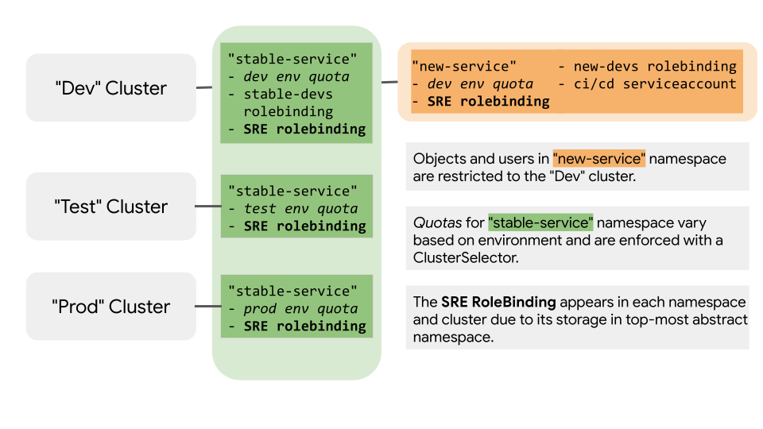

# Dev Team Self Service

`Dev Team Self Service` illustrates a workflow of onboarding a developer team
onto a platform that provides them with relevant Kubernetes resources.



In this example, you will add a new service to a Cluster named `dev`.

This new service includes the following objects:

* a "new-service" namespace
* an RBAC rolebinding
* a service account
* a resource quota

These configs restrict developers from changing the configuration of the `prod`
and `test` clusters.

## Contents

* [Prerequisites](#prerequisites)
* [Setup](#setup)
  * [Fork and Clone this Repo](#fork-and-clone-this-repo)
  * [Sync ACM Operator](#sync-acm-operator)
  * [Update Cluster Configs](#update-cluster-configs)
* [Config Overview](#config-overview)
* [Define Policy as Config](#define-policy-as-config)
* [Observe Enforcement Across Clusters](#observe-enforcement-across-clusters)

### Prerequisites

* Install the [Cloud SDK (gcloud
  CLI)](https://cloud.google.com/sdk/docs/quickstarts)
* Install
  [kubectl](https://kubernetes.io/docs/tasks/tools/install-kubectl/#download-as-part-of-the-google-cloud-sdk)
* Install the [nomos
  CLI](https://cloud.google.com/anthos-config-management/downloads) for managing
  ACM across clusters
* Create or select three [GKE
  Clusters](https://cloud.google.com/kubernetes-engine/docs/how-to/creating-a-cluster)
  with the [ACM Operator
  installed](https://cloud.google.com/anthos-config-management/docs/how-to/installing).
      * The configs in this repository assume the cluster names are `dev`, `test` and `prod`.

## Config Overview

This repository contains the following files:

```console
dev-team-self-service/
├── setup/ # configuration for each cluster's ACM Operator
│  ├── dev.config-management.yaml
│  ├── prod.config-management.yaml
│  └── test.config-management.yaml
└── config-root/ # directory ACM monitors for policy
   ├── README.md
   ├── system/
   ├── cluster/
   ├── clusterregistry # configs for ClusterSelectors and Clusters
   │   ├── cluster.dev.yaml
   │   ├── cluster.prod.yaml
   │   ├── cluster.test.yaml
   │   ├── clusterselector.env-dev.yaml
   │   ├── clusterselector.env-prod.yaml
   │   └── clusterselector.env-test.yaml
   └──  namespaces # configs that are scoped to namespaces
      ├── rolebinding.sre.yaml # inherited by namespaces below
      ├── new-service # uses env-dev selector
      │   ├── namespace.yaml
      │   ├── quota.yaml
      │   ├── rolebinding.new-eng.yaml
      │   └── serviceaccount.yaml
      └── stable-service # does not selector, present across all clusters
          ├── namespace.yaml
          ├── quota.dev.yaml # uses env-dev selector
          ├── quota.prod.yaml # uses env-prod selector
          └── quota.test.yaml # uses env-test selector
```

## Setup

This example assumes you have three clusters with ACM installed and with [read
access](https://cloud.google.com/anthos-config-management/docs/how-to/installing#git-creds-secret)
to a fork of this repo.  

To setup the clusters for this example you will need to:

* [Fork and clone this repo](#fork-and-clone-this-repo)
* [Sync each cluster's ACM operator with this
  directory](#sync-acm-operator-to-selecting-clusters).
* [Update all cluster configs with the names of your
  clusters.](#update-cluster-configs)

### Fork and clone this repo

1. Fork this repo to your account

1. In your terminal, clone this repo locally.

      ```console
      $ git clone https://github.com/<GITHUB_USERNAME>/csp-config-management.git
      $ cd csp-config-management/dev-team-self-service/
      ```

### Configure ACM Operator with dev-team-self-service/

Each cluster's ACM operator must be configured to point to the `config-root/` in `dev-team-self-service/`.

The setup directory and cluster configs for this example assumed the names
`dev`, `test` and `prod`.

Each cluster has its own config in the [setup/](setup/) directory.

If you are not using defaults names of `dev`, `test` and `prod`, update the cluster's name in the `spec.ClusterName` field.

1. Update the files in
   [setup/](setup/) to include your
   cluster names and git username.
   For example, if your github username is `example-username`, change each YAML to include
    ```yaml
    git:
      syncRepo: git@github.com:example-username/csp-config-management.git
    ```

1. Configure the ACM Operator for all clusters by repeating the following steps for
   `dev`, `test` and `prod` clusters.

    ```console
    # update local kubeconfig to correct cluster
    $ gcloud container clusters get-credentials <cluster name> --zone <cluster zone>
    # ensure kubectl is using correct context
    $ kubectl config get-context
    # apply configuration for cluster's ACM operator
    $ kubectl apply -f setup/<cluster name>.config-management.yaml
    ```

1. Confirm the sync was successful with `nomos status`.

    ```console
    $ nomos status
    Connecting to clusters...
    Context                                 Status           Last Synced Token
    -------                                 ------           -----------------
    dev-cluster-context                     SYNCED           <some commit hash>
    test-cluster-context                    SYNCED           <some commit hash>
    prod-cluster-context                    SYNCED           <some commit hash>
    ```

### Update Cluster Configs

`ClusterSelectors` are used to rollout policy to specific clusters. For
`ClusterSelectors` to work, clusters must be labeled with relevant metadata.

The `Cluster` configs are located in the [clusterregistry/](clusterregistry/)
directory.

ACM uses the `metadata.name` field to determine where `ClusterSelectors` apply.

If you are not using default names of `dev`, `test` and `prod`, update the cluster's names in the `metadata.name` field.  Then push your changes to git for them to be picked up by ACM.

First, ensure your cluster configs are valid.
```console
$ cd config-root/
$ nomos vet
```

Then, commit and push changes to git.
```console
$ git add clusterregistry/
$ git commit -m "updated cluster configs to point to my clusters"
$ git push origin master
```

## Define Policy as Config

In this directory, "new-service" is onboarded to a
development environment cluster while restricting it from testing and production
environments.  

### ClusterSelectors and Cluster Configs

A `ClusterSelector` checks a cluster's labels and applies a config only if there is a match.
You can specify these labels in a `Cluster` config.  [Read more about ClusterSelectors here.](https://cloud.google.com/anthos-config-management/docs/how-to/clusterselectors)

Three `Cluster` and `ClusterSelector` configs are defined in the [clusterregistry/](clusterregistry/)
directory.  Each cluster has an evironment label of either
["dev"](clusterregistry/cluster.dev.yaml),
["test"](clusterregistry/cluster.test.yaml) or
["prod"](clusterregistry/cluster.prod.yaml).  These labels are used by three
corresponding `ClusterSelectors` to apply configs to specific clusters:
["env-dev"](clusterregistry/clusterselector.env-dev.yaml),
["env-test"]((clusterregistry/clusterselector.env-test.yaml)) and
["env-prod"](clusterregistry/clusterselector.env-prod.yaml).

### Quotas

`ClusterSelectors` are used in each of `ResourceQuota` configs for
["stable-service"](namespaces/stable-service).  For example,
[quota.prod.yaml](namespaces/stable-service/quota.prod.yaml) uses the "env-prod"
selector to apply the prod quota to only clusters with the prod environment
label.

### RoleBindings

Anthos Config Managment uses inheritance in the "namespaces/" directory across
abstract namespaces and associated subdirectories.  [Read more about Namespace
Inheritance in ACM here](https://cloud.google.com/anthos-config-management/docs/how-to/namespace-scoped-objects#inheritance)

The [SRE rolebinding](namespaces/rolebinding.sre.yaml) exists in the root
abstract namespace.  All other namespaces in subdirectories below it inherit
config that exist above it.  The SRE rolebinding is applied across all clusters.

The [new-eng](namespaces/rolebinding.new-eng.yaml) rolebinding is at a leaf node
(no other subdirectories below it).  Consequently, no other namespaces will
inherit the config in this directory.  Also, the rolebinding references the
"env-dev" `ClusterSelector` ensuring that it will not be applied to clusters
without the dev environment label.

## Observe Enforcement Across Clusters

### View Cluster Configs Locally

The [`nomos hydrate`](https://cloud.google.com/anthos-config-management/docs/how-to/nomos-command#hydrate) command generates the combined contents of each enrolled cluster.

```console
# go to root of this example directory
$ cd ..
$ nomos hydrate --path=config-root/
$ ls compiled/
```

The `nomos hydate` command creates a folder named "compiled".  Each subdirectory
contains the fully-resolved configs that the Operator would apply to the cluster.

```console
├── defaultcluster # this is applied to a cluster without a label, not used in this example
│   └── stable-service
│       └── rolebinding_sre-admin.yaml
├── dev # applied to dev cluster
│   ├── new-service
│   │   ├── resourcequota_dev-new-quota.yaml
│   │   ├── rolebinding_new-devs.yaml
│   │   ├── rolebinding_sre-admin.yaml
│   │   └── serviceaccount_new-eng-build.yaml
│   └── stable-service
│       ├── resourcequota_dev-stable-quota.yaml
│       ├── rolebinding_sre-admin.yaml
│       └── rolebinding_stable-devs.yaml
├── prod # applied to prod cluster
│   └── stable-service
│       ├── resourcequota_prod-compute-quota.yaml
│       └── rolebinding_sre-admin.yaml
└── test # applied to test cluster
    └── stable-service
        ├── resourcequota_test-compute-quota.yaml
        └── rolebinding_sre-admin.yaml
```

### View State across Clusters

Next, verify your `dev` cluster's state has the expected objects.

1. Ensure your kubectl context is pointing to dev cluster

      ```console
      # update local kubeconfig to correct cluster
      $ gcloud container clusters get-credentials dev --zone <cluster zone>
      # ensure kubectl is using correct context
      $ kubectl config get-context
      ```

1. Get dev environment objects with `kubectl`
    Lets start with resources in the "new-service" namespace

      ```console
      # these should all be successful
      $ kubectl get namespace new-service
      $ kubectl get quota dev-compute-quota -n new-service
      $ kubectl get rolebinding new-eng -n new-service
      $ kubectl get rolebinding sre-admin -n new-service
      ```

Next, confirm that these objects don't exist in your `prod` or `test` clusters.
Repeat the following steps for both prod and test clusters.

1. Ensure your kubectl context is pointing to the correct cluster

      ```console
      # update local kubeconfig to correct cluster
      $ gcloud container clusters get-credentials <prod / test cluster name> --zone <cluster zone>
      # ensure kubectl is using correct context
      $ kubectl config get-context
      ```

1. Verify that dev environment objects *do not* exist with `kubectl`

      ```console
      # these requests should all return an error
      $ kubectl get namespace new-service
      $ kubectl get quota dev-compute-quota -n new-service
      $ kubectl get rolebinding new-eng -n new-service
      $ kubectl get rolebinding sre-admin -n new-service
      ```

1. Confirm that prod environment objects are in place with `kubectl`

      ```console
      # these requests should all be successful
      $ kubectl get namespace stable-service
      $ kubectl get quota <prod or test>-compute-quota
      ```

You have successfully:

* selectively created namespaces in `dev` clusters
* restricted developer access to only `dev` clusters
* applied different quotas to associated environments
